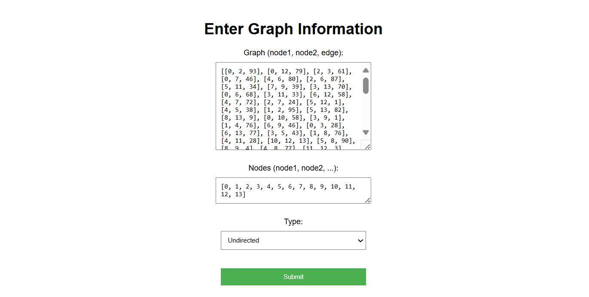
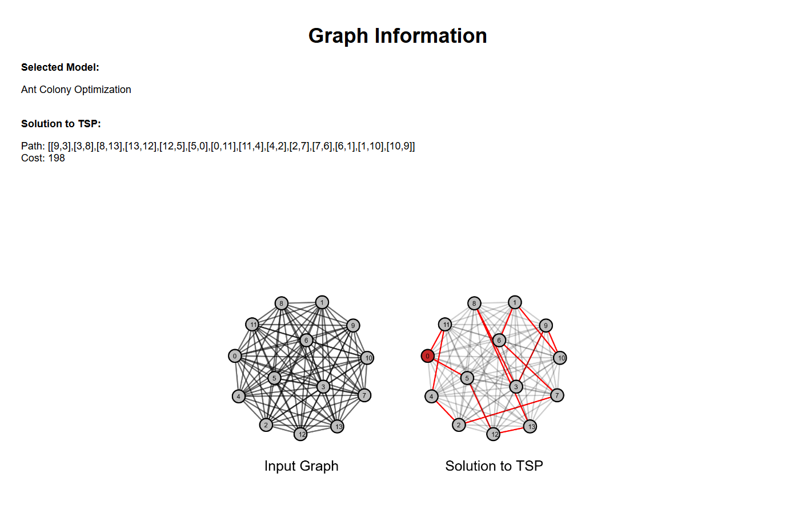

---
author:
- Sagnik Chakraborty
- Bhaswar Chakraborty
date: "Department of Computer Science, Scottish Church College"
title: Comparative Study of Metaheuristic Models for Solving Travelling Salesperson Problem
abstract: The Traveling Salesman Problem (TSP) is a classic optimization challenge that has been extensively studied due to its NP-hard nature and practical applications in various fields. This project investigates and compares the performance of five metaheuristic algorithms—Ant Colony Optimization (ACO), Particle Swarm Optimization (PSO), Artificial Bee Colony (ABC), Simulated Annealing (SA), and Genetic Algorithm (GA)—in solving the TSP. Each algorithm's efficacy is evaluated based on solution quality and convergence speed. The project includes a user-friendly frontend interface allowing users to input the graph and visualize the optimal path alongside convergence charts. This comprehensive comparison aims to provide insights into the strengths and weaknesses of each metaheuristic approach, guiding future research and practical applications in optimization problems.
geometry:
- margin=1in
fontsize: 11pt
listings: false
bibliography: refs.bib
nocite: |
  @*
numbersections: true
header-includes: |
    \usepackage{tikzit}
    \usepackage{multirow}
    \usepackage{rotating}
    \usepackage{algorithm}
    \usepackage{algpseudocode}
    \usepackage{graphicx}
    \input{styles.tikzstyles}
    \usepackage[document]{ragged2e}
---

\maketitle
\newpage
\tableofcontents

\newpage

# Introduction

The Traveling Salesman Problem (TSP) is a quintessential optimization problem that has captivated researchers for decades. It involves finding the shortest possible route that allows a salesman to visit each city exactly once and return to the origin city. Despite its deceptively simple formulation, the TSP belongs to the class of NP-hard problems, meaning that no known algorithm can solve all instances of the problem in polynomial time. As such, the TSP serves as a benchmark for evaluating optimization algorithms and has applications in logistics, manufacturing, telecommunications, and more.

Metaheuristics are a family of optimization algorithms designed to find high-quality solutions for complex problems within a reasonable timeframe. Unlike exact algorithms, which guarantee an optimal solution, metaheuristics provide approximate solutions, making them particularly useful for large-scale and complex problems like the TSP. Metaheuristics combine strategies inspired by natural phenomena and social behaviors to explore and exploit the search space effectively.

This project focuses on five prominent metaheuristic algorithms: Ant Colony Optimization (ACO), Particle Swarm Optimization (PSO), Artificial Bee Colony (ABC), Simulated Annealing (SA), and Genetic Algorithm (GA). Each of these algorithms employs a unique mechanism to navigate the search space and converge towards optimal or near-optimal solutions.

Ant Colony Optimization (ACO) is inspired by the foraging behavior of ants. Ants deposit pheromones on paths they traverse, and the probability of choosing a path increases with the amount of pheromone deposited. This positive feedback loop enables the discovery of the shortest paths in a graph.

Particle Swarm Optimization (PSO) mimics the social behavior of birds flocking or fish schooling. Particles (representing potential solutions) move through the search space influenced by their own best-known position and the best-known positions of their neighbors. This collaboration and competition lead to the identification of optimal solutions.

Artificial Bee Colony (ABC) algorithm draws inspiration from the foraging behavior of honey bees. Bees search for food sources and share information about their quality, allowing the colony to collectively hone in on the most promising solutions.

Simulated Annealing (SA) is inspired by the annealing process in metallurgy, where controlled cooling of a material leads to a state of minimum energy. SA probabilistically accepts worse solutions to escape local optima, gradually reducing the acceptance probability as the search progresses.

Genetic Algorithm (GA) is based on the principles of natural selection and genetics. It operates on a population of potential solutions, applying selection, crossover, and mutation operators to evolve better solutions over successive generations.

The primary objective of this project is to implement these five metaheuristic algorithms to solve the TSP and compare their performance. Performance metrics include solution quality, convergence speed, and computational efficiency. A secondary objective is to develop a user-friendly frontend interface for inputting the graph and visualizing the best path and convergence chart.

The significance of this project lies in its comprehensive comparison of different metaheuristic approaches, providing valuable insights into their strengths and weaknesses. By examining the performance of these algorithms on the TSP, we aim to contribute to the broader understanding of metaheuristic optimization and guide future research and practical applications in various fields.

In the following sections, we will detail the methodology used for implementing each algorithm, the experimental setup, and the results of our comparative analysis. The ultimate goal is to offer a thorough evaluation that can inform the selection of appropriate metaheuristic strategies for solving the TSP and similar optimization problems.


# Background/Review of related work

The Traveling Salesman Problem (TSP) is a cornerstone of combinatorial optimization, with a variety of methods developed to tackle it. These methods range from exact algorithms that guarantee optimal solutions to heuristic and metaheuristic approaches that provide high-quality approximate solutions within a reasonable timeframe. A list of pre-existing algorithms are shown below.

## Exact Algorithms

### Brute Force Search

Description: This method involves evaluating all possible permutations of the cities to determine the shortest route.  
Complexity: The time complexity is O(n!), making it impractical for large instances due to the factorial growth in the number of permutations.  
Use Case: Suitable for small instances of TSP where the number of cities is manageable.

### Dynamic Programming (Held-Karp Algorithm):

Description: This approach uses dynamic programming to reduce the computational complexity of the TSP. It breaks the problem into overlapping subproblems, solving each subproblem only once and storing the solutions.  
Complexity: The Held-Karp algorithm has a time complexity of $O(n^2 * 2^n)$, which is more efficient than brute force but still exponential.  
Use Case: Applicable for moderate-sized instances where exact solutions are necessary, but the problem size is not exceedingly large.

### Branch and Bound

Description: This method systematically explores branches of the solution space, pruning branches that cannot yield better solutions than already found ones.  
Complexity: The efficiency of branch and bound depends on the specific problem instance and the quality of the bounds used.  
Use Case: Useful for problems where good bounds can be established, reducing the search space significantly.  

### Cutting Planes and Integer Linear Programming (ILP)

Description: These methods formulate the TSP as an integer linear programming problem and iteratively refine the solution space using cutting planes to exclude non-optimal solutions.  
Complexity: The efficiency varies based on the formulation and the specific cutting planes used.  
Use Case: Tools like Concorde TSP Solver employ these techniques effectively for solving large-scale instances.  

## Heuristic Approaches

Heuristics are problem-specific strategies that aim to find good solutions quickly without guaranteeing optimality. They are particularly useful for large instances where exact methods are infeasible.

### Nearest Neighbor Heuristic

Description: This heuristic starts at an arbitrary city and repeatedly visits the nearest unvisited city until all cities are visited.  
Complexity: $O(n^2)$ due to the repeated nearest neighbor search.  
Use Case: Fast and easy to implement but may produce suboptimal solutions, especially for larger instances.

## Nearest Insertion Heuristic

Description: This method starts with a sub-tour of two cities and iteratively inserts the nearest city to the current sub-tour.  
Complexity: $O(n^2)$.  
Use Case: Provides better solutions than the nearest neighbor heuristic but still may not be optimal.

## Christofides' Algorithm

Description: This algorithm constructs a minimum spanning tree, finds a minimum-weight perfect matching for the odd-degree vertices, and combines these to form a Hamiltonian cycle.  
Complexity: $O(n^3)$.  
Use Case: Guarantees a solution within 1.5 times the optimal solution for metric TSP instances.

In this project we aim to see how metaheursitic models fare against these traditional methods of solving TSP. There has been extensive research on such models and have been used to solve multiple different sets of problems by tweaking their parameters. Brief backgrounds for models used in this project are listed below.

- *Ant Colony Optimization* (ACO) was introduced by Marco Dorigo in the early 1990s. Inspired by the foraging behavior of ants, ACO has been successfully applied to the TSP and other combinatorial optimization problems. ACO algorithms simulate the pheromone-laying and following behavior of ants to iteratively construct solutions and reinforce successful paths. Numerous variations and improvements of the original ACO algorithm have been proposed, enhancing its performance and robustness.

- *Particle Swarm Optimization* (PSO), developed by James Kennedy and Russell Eberhart in 1995, models the social behavior of birds flocking or fish schooling. In PSO, particles representing potential solutions move through the search space influenced by their own best positions and the best positions of their neighbors. PSO has been effectively applied to the TSP and various other optimization problems, with many studies focusing on hybridizing PSO with other techniques to improve performance.

- *Artificial Bee Colony* (ABC), proposed by Karaboga in 2005, is inspired by the foraging behavior of honey bees. ABC divides the search process into employed bees, onlookers, and scouts, each with specific roles in exploring and exploiting the search space. ABC has shown competitive performance on the TSP and has been the subject of numerous modifications and hybrid approaches to enhance its effectiveness.

- *Simulated Annealing* (SA), introduced by Kirkpatrick, Gelatt, and Vecchi in 1983, is inspired by the annealing process in metallurgy. SA probabilistically accepts worse solutions to escape local optima, with the acceptance probability decreasing over time. SA has been widely applied to the TSP and remains a popular choice due to its simplicity and effectiveness.

- *Genetic Algorithms* (GA), introduced by John Holland in the 1970s, are based on the principles of natural selection and genetics. GAs operate on a population of potential solutions, applying selection, crossover, and mutation operators to evolve better solutions over successive generations. GAs have been extensively studied and applied to the TSP, with numerous variants and hybrid approaches proposed to enhance performance.

Each of these metaheuristic algorithms has been extensively studied and applied to different complex problems in varied domains, demonstrating varying degrees of success. Numerous comparative studies have been conducted to evaluate their performance on different instances of the TSP, providing valuable insights into their strengths and weaknesses. This project builds on this rich body of work by implementing and comparing these five metaheuristic algorithms in a unified framework, providing a comprehensive evaluation of their performance on the TSP.


# Metaheuristics

Metaheuristics are high-level algorithmic frameworks designed to solve complex optimization problems by guiding the search process to explore and exploit the solution space effectively. Unlike exact algorithms that guarantee finding an optimal solution, metaheuristics aim to find good enough solutions within a reasonable timeframe, making them particularly useful for large-scale and NP-hard problems like the Traveling Salesman Problem (TSP).

## Characteristics of Metaheuristics

1. Problem Independence: Metaheuristics are generally applicable to a wide range of optimization problems, not just specific ones. This broad applicability makes them versatile tools for solving various types of problems.
2. Exploration and Exploitation: Effective metaheuristics balance exploration (searching new areas of the solution space) and exploitation (refining current promising areas). This balance helps in avoiding local optima and converging towards global optima.
3. Stochastic Components: Many metaheuristics incorporate randomization to explore the solution space. This stochastic nature helps in diversifying the search and escaping local optima.
4. Iterative Process: Metaheuristics typically involve iterative processes, repeatedly refining solutions until a stopping criterion is met (e.g., a maximum number of iterations, a time limit, or a convergence threshold).

## Advantages of Metaheuristics

1. Scalability: Metaheuristics can handle large-scale problems that are infeasible for exact algorithms due to their ability to provide approximate solutions quickly.
2. Flexibility: Metaheuristics can be adapted to various types of optimization problems, including both discrete and continuous problems.
3. Simplicity: Many metaheuristics are easy to implement and understand, making them accessible for practical applications.
4. Robustness: Metaheuristics are often robust to changes in problem parameters and can provide good solutions under different conditions.

## Challenges and Limitations

1. No Guarantee of Optimality: Metaheuristics do not guarantee finding the optimal solution, which can be a drawback for problems where optimality is crucial.
2. Parameter Tuning: The performance of metaheuristics often depends on the appropriate setting of parameters (e.g., cooling schedule in SA, population size in GA), which can be challenging and problem-specific.
3. Convergence Issues: Metaheuristics may converge prematurely to suboptimal solutions or require a large number of iterations to find good solutions.

## Applications

Metaheuristics are applied across various domains due to their versatility and effectiveness. Some notable applications include:

- Logistics and Transportation: Solving vehicle routing problems, scheduling, and resource allocation.
- Manufacturing: Optimizing production processes, job-shop scheduling, and layout design.
- Telecommunications: Network design, load balancing, and routing optimization.
- Finance: Portfolio optimization, risk management, and financial forecasting.
- Bioinformatics: Sequence alignment, protein structure prediction, and drug design.

In this project, we focus on implementing and comparing the performance of ACO, PSO, ABC, SA, and GA for solving the TSP. By evaluating their solution quality, convergence speed, and computational efficiency, we aim to provide insights into the strengths and weaknesses of each metaheuristic approach, guiding future research and practical applications in optimization problems.


# Traveling Salesperson Problem

The Traveling Salesman Problem (TSP) is a classic problem in the field of combinatorial optimization and theoretical computer science. Despite its straightforward formulation, the TSP remains one of the most intensely studied and challenging problems, due to its computational complexity and wide range of applications.

## Problem Definition

The TSP can be formally defined as follows:

- Input: A list of cities, along with the distances (or costs) between each pair of cities.
- Objective: Find the shortest possible route that visits each city exactly once and returns to the starting city.

In mathematical terms, given a set of $n$ cities, the goal is to find a permutation $\pi$ of the cities that minimizes the total travel distance:

$$
\min_{\pi} \left( \sum_{i=1}^{n-1} d(\pi(i), \pi(i+1)) + d(\pi(n), \pi(1)) \right)
$$

where $d(i, j)$ is the distance between city $i$ and city $j$.

## Types of TSP

1. Symmetric TSP (STSP):
   - Description: The distance between two cities is the same in both directions, i.e., $d(i, j) = d(j, i)$.
   - Applications: Common in scenarios where the travel cost or distance does not depend on the direction, such as road networks.

2. Asymmetric TSP (ATSP):
   - Description: The distance between two cities may differ based on the direction of travel, i.e., $d(i, j) \neq d(j, i)$.
   - Applications: Relevant in logistics and transportation problems where factors like one-way streets or different travel times affect the distance.

3. Dynamic TSP:
   - Description: The set of cities or the distances between them can change over time.
   - Applications: Real-time logistics and delivery systems where conditions may vary dynamically.

4. Multiple Traveling Salesman Problem (mTSP):
   - Description: Multiple salesmen are involved, each starting and ending at a central depot.
   - Applications: Used in scenarios like vehicle routing where multiple vehicles are dispatched from a central location.

## Applications

The TSP is not just a theoretical problem but has numerous practical applications, including:

1. Logistics and Transportation:
   - Vehicle Routing: Optimizing delivery routes for trucks, drones, or couriers to minimize travel time and costs.

2. Manufacturing:
   - Tool Path Optimization: Minimizing the movement of tools in CNC machines to reduce production time.
   - Robotic Arm Movement: Planning the movements of robotic arms in assembly lines to minimize the distance traveled.

3. Telecommunications:
   - Network Design: Optimizing the layout of communication networks to reduce latency and improve efficiency.
   - Circuit Board Design: Arranging components on a circuit board to minimize the length of wiring.

4. Biology and Bioinformatics:
   - Genome Sequencing: Finding the shortest common supersequence of a set of DNA fragments.
   - Protein Folding: Modeling the folding pathways of proteins to predict their three-dimensional structure.

5. Travel and Tourism:
   - Tour Planning: Designing optimal itineraries for tourists to visit multiple attractions efficiently.
   - Sales Route Optimization: Planning the most efficient routes for sales representatives to visit clients.

## Computational Complexity

The TSP is classified as an NP-hard problem, meaning that no known polynomial-time algorithm can solve all instances of the problem optimally. This computational intractability has led to the development of various exact, heuristic, and metaheuristic approaches to tackle the TSP.

1. Exact Algorithms:
   - Methods like brute force search, dynamic programming (Held-Karp algorithm), branch and bound, and integer linear programming guarantee finding the optimal solution but are often impractical for large instances due to their high computational requirements.

2. Heuristic Algorithms:
   - Simple, problem-specific strategies such as the nearest neighbor, nearest insertion, and Christofides' algorithm provide quick but often suboptimal solutions, useful for large instances where exact methods are infeasible.

3. Metaheuristic Algorithms:
   - High-level strategies like Genetic Algorithms (GA), Simulated Annealing (SA), Ant Colony Optimization (ACO), Particle Swarm Optimization (PSO), and Artificial Bee Colony (ABC) are designed to explore the solution space effectively and find high-quality solutions within reasonable time frames. These methods are particularly useful for solving large-scale and complex TSP instances.

## Importance of the TSP

The TSP's importance lies in its applicability across diverse fields and its role as a benchmark problem for testing and comparing optimization algorithms. Research on the TSP has driven advancements in algorithm design, computational techniques, and theoretical understanding of combinatorial optimization. Solving the TSP efficiently can lead to significant improvements in operational efficiency, cost savings, and overall performance in practical application


# Metaheuristic Models

## Ant Colony Optimization

### Description

Ant Colony Optimization (ACO) is a metaheuristic inspired by the foraging behavior of ants. Real ants deposit pheromones on paths they travel, which guides other ants to food sources. Similarly, ACO uses a population of artificial ants that cooperate to find good solutions to optimization problems by depositing virtual pheromones on paths in a solution space.

### Mathematical Basis

The mathematical foundation of ACO involves the use of probabilistic transition rules to construct solutions and the pheromone update mechanism. The key components are:

1. Pheromone Trail ($\tau_{ij}$): Represents the desirability of moving from node $i$ to node $j$.
2. Heuristic Information ($\eta_{ij}$): Represents the desirability of choosing node $j$ when at node $i$, often inversely proportional to the distance for TSP.
3. Probability of Transition: The probability $P_{ij}$ that an ant moves from node $i$ to node $j$ is given by:

$$ 
P_{ij}(t) = \frac{[\tau_{ij}(t)]^\alpha [\eta_{ij}]^\beta}{\sum_{k \in \text{N}(i)} [\tau_{ik}(t)]^\alpha [\eta_{ik}]^\beta} 
$$

Where:

- $\tau_{ij}(t)$ is the pheromone level on the edge $(i, j)$ at time $t$.
- $\eta_{ij}$ is the heuristic desirability of edge $(i, j)$.
 $\alpha$ and $\beta$ are parameters that control the relative importance of pheromone versus heuristic information.
- $\text{N}(i)$ is the set of feasible nodes to move to from node $i$.

4. Pheromone Update: After all ants have constructed their solutions, the pheromone levels are updated:

$$ 
\tau_{ij}(t+1) = (1 - \rho) \tau_{ij}(t) + \sum_{k=1}^{m} \Delta \tau_{ij}^k
$$

Where:

- $\rho$ is the pheromone evaporation rate.
- $\Delta \tau_{ij}^k$ is the amount of pheromone deposited by the $k$-th ant.

### Metaphor

The metaphor behind ACO is based on the behavior of real ants. When ants search for food, they initially explore the area randomly. Upon finding food, they return to the nest while laying down a trail of pheromones. Other ants are likely to follow paths with stronger pheromone concentrations, which in turn reinforce those paths if they too find food. Over time, the shortest path to the food source emerges as the most traveled path due to higher pheromone concentration.

### Algorithm to Solve TSP

1. Initialization: Initialize pheromone levels $\tau_{ij}(0)$ for all edges $(i, j)$ and set parameters $\alpha$, $\beta$, and $\rho$.

2. Solution Construction: For each ant:
   - Start at a randomly chosen node.
   - Repeat until a complete tour is constructed:
     - Choose the next node $j$ based on the probability $P_{ij}(t)$.
     - Move to node $j$ and add $j$ to the list of visited nodes.

3. Pheromone Update:
   - Apply pheromone evaporation on all edges.
   - Deposit new pheromones based on the constructed tours.

4. Daemon Actions (optional): Implement additional actions such as global pheromone updates or local search procedures to improve solutions.

5. Termination: Repeat the solution construction and pheromone update steps until a termination condition is met (e.g., a fixed number of iterations or a convergence criterion).

<!-- #### Pseudo-Code -->

\begin{algorithm}[H]
    \caption{Ant-Colony Optimization}\label{alg:aco}
    \begin{algorithmic}
        \State \textbf{initialize} pheromone levels $\tau_{ij}(0)$
        \For{$t = 1 \rightarrow$ \texttt{max\_iterations}}
            \For{each ant  $k$}
                \State \textbf{choose} a starting node
                \While{the tour is not complete do}
                    \State \textbf{select} the next node $j$ based on transition probability $P_{ij}(t)$
                    \State \textbf{move} to node j and update tour
                \EndWhile
                \State \textbf{evaluate} the constructed tour
            \EndFor
            \State \textbf{evaporate} pheromones on all edges
            \For{each ant $k$}
                \State \textbf{deposit} pheromones based on the quality of the constructed tour
            \EndFor
        \EndFor
    \end{algorithmic}
\end{algorithm}

## Genetic Algorithm

### Description

Genetic Algorithm (GA) is a metaheuristic inspired by the process of natural selection. In Darwinian theory of evolution, organisms that are more adapted to their environment are more likely to survive and pass on the genes that aided their success. These naturally selected organisms mate and mutate among themselves to create a new generation that are more adaptable to the environment. In GA, a population of candidate solutions are first "guessed", and in a similar manner, the fittest solutions are combined and occasionally mutated to create a new generation of solution, which should be better than the previous ones.

### Mathematical Basis

Since genetic algorithms are designed to simulate a biological process, much of the relevant terminology is borrowed from biology. However the entities in this terminology are much simpler in nature than its biological counterparts. The different components are:

1. Fitness Function ($f$):  The fitness function is the function that the algorithm is trying to optimize. The word "fitness" is taken from evolutionary theory. It is one of the more pivotal points of the algorithm. The fitness function must be more sensitive than just detecting what is a "good" chromosome versus a "bad" chromosome: it needs to accurately score the chromosomes based on a range of fitness values, so that a somewhat complete solution can be distinguished from a more complete solution.
2. Population of Chromosomes ($C$): A *chromosome* is a numerical value or values that represent a candidate solution to the problem that the genetic algorithm is trying to solve. Each candidate solution is encoded as an array of parameter values. If a problem has $N_{\text{par}}$ dimensions, then typically each chromosome is encoded as an $N_{\text{par}}$-element array:
$$
\text{chromosome}=[p_1, p_2, p_3,...,p_{N_{\text{par}}}]
$$
Where each $p_i$ is a particular value of the $i^{th}$ parameter. Most popular approach is to convert each parameter into a bit string, then to concatenate the parameters like genes in a DNA strand to form a chromosome. A genetic algorithm begins with a randomly chosen assortment of chromosomes, which serves as the first generation (initial population). 

3. Selection Operator: The *selection operator* chooses the chromosomes that are to be used in the reproduction of the next generation. It is done based on a probability distribution given by the user: the fitter the chromosome is, the more likely it is to be selected. If $f$ is the fitness function, then the probability of the chromosome $j$ to be selected may be:
$$
P(C_n)=\left|\frac{f(C_n)}{\sum_{i=0}^{N_{\text{pop}}} f(C_i)}\right|
$$

4. Crossover Operator: The *crossover operator* resembles the crossing over and recombination of chromosomes during meiosis.  This operator swaps a subsequence of two of the chosen chromosomes to create two o spring. For example, if the parent chromosomes. For example if the parent chromosomes are:
$$
[11010111001000] \text{ and } [01011101010010]
$$
And if they are crossed over after the fourth bit, then the offspring would be:
$$
 [01010111001000] \text{ and } [11011101010010]
$$
5. Mutation Operator: The *mutation operator* randomly flips individual bits in the new chromosome. Usually the probability of mutation is very low, such as 0.001. 


### Metaphor

The metaphor behind GA is based on the Darwinian theory of evolution. Organisms that are more adaptable to the environment thrive and mate within their population, and the next generation thereby becomes even better than the parent generation. This biological phenomenon is known as the Natural Selection. Mutation is an abrupt change in gene which is occasionally introduced during cell division, which generates the genetic variation on which the evolutionary process depends.

### Algorithm to Solve TSP

1. Initialization: Generate N random candidate routes and calculate fitness value for each route. 
1. Repeat following steps _Number of iteration_ times:

    i. Selection: Select two best candidate routes. 
    i. Reproduction:  Reproduce  two  routes  from  the  best   routes.
    i. Generate  new  population:  Replace  the  two  worst routes  with the new routes. 

1. Termination: Return the best result after all the iterations.

\begin{algorithm}[H]
    \caption{Genetic Algorithm}\label{alg:ga}
    \begin{algorithmic}
        \State \textbf{set} cooling parameter = 0
        \State \textbf{evaluate} population $P(t)$
        \While{not done}
            \State \textbf{set} parents(t) $\gets$ select\_parents($P(t)$)
            \State \textbf{set} offspring(t) $\gets$ procreate\_and\_mutate($P(t)$)
            \State \textbf{set} $P(t+1)$ $\gets$ select\_survivors($P(t)$, offspring(t))
            \State \textbf{set} $t \gets t+1$
        \EndWhile   
    \end{algorithmic}
\end{algorithm}

## Particle Swarm Optimization

### Description

Particle Swarm Optimization (PSO) is a metaheuristic inspired by the social behavior of birds flocking or fish schooling. In PSO, a population of candidate solutions, called particles, move around the search space influenced by their own best known positions and the best known positions of the entire swarm. This cooperation among particles allows PSO to efficiently explore the search space and converge on optimal solutions.

### Mathematical Basis

The mathematical foundation of PSO involves updating the positions and velocities of particles based on their own experience and that of their neighbors. The key components are:

1. Position ($x_i$): Represents the current position of particle $i$ in the search space.
2. Velocity ($v_i$): Represents the change in position for particle $i$.
3. Personal Best ($p_i$): Represents the best position found by particle $i$.
4. Global Best ($g$): Represents the best position found by the entire swarm.

The position and velocity of each particle are updated using the following equations:

$$ 
v_i(t+1) = \omega v_i(t) + c_1 r_1 (p_i - x_i(t)) + c_2 r_2 (g - x_i(t)) 
$$

$$ 
x_i(t+1) = x_i(t) + v_i(t+1) 
$$

Where:

- $\omega$ is the inertia weight that controls the influence of the previous velocity.
- $c_1$ and $c_2$ are acceleration coefficients that control the influence of personal and global best positions.
- $r_1$ and $r_2$ are random numbers between 0 and 1.

### Metaphor

The metaphor behind PSO is based on the collective behavior observed in flocks of birds or schools of fish. Each particle (bird or fish) adjusts its trajectory based on its own experience and the success of its neighbors, leading to a coordinated movement towards the best solution (food source or destination).

### Algorithm to Solve TSP

1. Initialization: Initialize the positions and velocities of particles randomly and set parameters $\omega$, $c_1$, and $c_2$.

2. Evaluate Fitness: Evaluate the fitness of each particle based on the total distance of the tour.

3. Update Personal and Global Bests: Update the personal best position for each particle and the global best position for the swarm.

4. Update Velocities and Positions:
   - Update the velocity of each particle using the velocity update equation.
   - Update the position of each particle using the position update equation.

5. Termination: Repeat the evaluation and update steps until a termination condition is met (e.g., a fixed number of iterations or a convergence criterion).

\begin{algorithm}[H]
    \caption{Particle Swarm Optimization}\label{alg:pso}
    \begin{algorithmic}
        \State \textbf{initialize} positions $x_i$ and velocities $v_i$ for all particles
        \State \textbf{initialize} personal best $p_i$ and global best $g$
        \For{$t = 1 \rightarrow$ \texttt{max\_iterations}}
            \For{each particle $i$}
                \State \textbf{evaluate} fitness of particle $i$
                \State \textbf{update} personal best $p_i$ and global best $g$
                \State \textbf{update} velocity $v_i$ using the velocity update equation
                \State \textbf{update} position $x_i$ using the position update equation
            \EndFor
        \EndFor
    \end{algorithmic}
\end{algorithm}

## Simulated Annealing

### Description

Simulated Annealing (SA) is a metaheuristic inspired by the annealing process in metallurgy. Annealing involves heating and slowly cooling a material to decrease defects, thereby finding a state with lower energy. Similarly, SA explores the solution space by allowing random moves that worsen the objective function but with decreasing probability over time, which helps avoid local optima.

### Mathematical Basis

The mathematical foundation of SA involves the use of a temperature parameter that controls the probability of accepting worse solutions. The key components are:

1. Temperature ($T$): Controls the probability of accepting worse solutions.
2. Acceptance Probability: The probability $P$ of accepting a worse solution is given by:

$$ 
P(\Delta E, T) = \exp\left(-\frac{\Delta E}{T}\right) 
$$

Where:

- $\Delta E$ is the change in the objective function value (e.g., increase in tour length for TSP).
- $T$ is the current temperature.

### Metaphor

The metaphor behind SA is based on the physical annealing process. Just as a metal is heated and then slowly cooled to reach a low-energy state, SA explores the solution space by accepting worse solutions with decreasing probability, allowing it to escape local optima and eventually converge on a near-optimal solution.

### Algorithm to Solve TSP

1. Initialization: Initialize the temperature $T$ and a current solution.

2. Evaluate Fitness: Evaluate the fitness of the current solution.

3. Generate Neighbor: Generate a neighbor solution by making a small change to the current solution (e.g., swapping two cities in the tour).

4. Acceptance Probability:
   - Calculate the change in the objective function $\Delta E$.
   - Accept the neighbor solution with probability $P(\Delta E, T)$.

5. Update Temperature: Decrease the temperature according to a cooling schedule.

6. Termination: Repeat the evaluation, neighbor generation, acceptance, and temperature update steps until a termination condition is met (e.g., a fixed number of iterations or the temperature falls below a threshold).

\begin{algorithm}[H]
    \caption{Simulated Annealing}\label{alg:sa}
    \begin{algorithmic}
        \State \textbf{initialize} temperature $T$ and current solution
        \State \textbf{evaluate} fitness of the current solution
        \For{$t = 1 \rightarrow$ \texttt{max\_iterations}}
            \State \textbf{generate} a neighbor solution
            \State \textbf{calculate} $\Delta E$ and acceptance probability $P(\Delta E, T)$
            \If{neighbor solution is accepted}
                \State \textbf{update} current solution
            \EndIf
            \State \textbf{decrease} temperature $T$
        \EndFor
    \end{algorithmic}
\end{algorithm}

## Artificial Bee Colony (ABC)

### Description

Artificial Bee Colony (ABC) is a metaheuristic inspired by the foraging behavior of honey bees. In the ABC algorithm, the colony consists of three groups of bees: employed bees, onlookers, and scouts. Employed bees search for food sources (solutions), onlookers watch the dances of employed bees to choose food sources, and scouts randomly search for new food sources.

### Mathematical Basis

The mathematical foundation of ABC involves the exploration and exploitation of food sources in the search space. The key components are:

1. Food Source ($x_i$): Represents a potential solution to the optimization problem.
2. Employed Bees: Each employed bee is associated with a specific food source and searches for new food sources in the neighborhood.
3. Onlookers: Onlookers evaluate the quality of food sources discovered by employed bees and choose which sources to exploit based on a probability related to the fitness of the food sources.
4. Scouts: Scouts explore the search space randomly to discover new food sources.

The main steps are:

1. Initialization: Initialize the food sources randomly and evaluate their fitness.
2. Employed Bee Phase: Each employed bee searches for a new food source in the neighborhood of its current source using:

$$ 
v_{ij} = x_{ij} + \phi_{ij} (x_{ij} - x_{kj})
$$

Where:
- $x_{ij}$ is the current food source.
- $x_{kj}$ is a randomly selected food source.
- $\phi_{ij}$ is a random number in the range [-1, 1].

3. Onlooker Bee Phase: Onlookers choose food sources based on a probability proportional to the fitness of the sources:

$$ 
P_i = \frac{f_i}{\sum_{k=1}^{N} f_k}
$$

Where:
- $f_i$ is the fitness of the $i$-th food source.
- $N$ is the number of food sources.

4. Scout Bee Phase: If a food source is not improved over a certain number of cycles, it is abandoned, and the scout bee searches for a new random food source.

5. Memorize the Best Solution: Keep track of the best food source found so far.

6. Termination: Repeat the above steps until a termination condition is met (e.g., a fixed number of iterations or convergence criterion).

### Metaphor

The metaphor behind ABC is based on the foraging behavior of honey bees. Employed bees explore known food sources and share information with onlookers through a waggle dance. Onlookers observe these dances and choose food sources based on their quality. Scouts explore the environment randomly to find new food sources. This collective behavior allows the bee colony to efficiently find and exploit the best food sources.

### Algorithm to Solve TSP

1. Initialization: Generate a set of initial food sources (solutions) randomly.
2. Repeat until termination condition is met:
   - Employed Bee Phase: Each employed bee searches for a new food source in the neighborhood and updates its position.
   - Onlooker Bee Phase: Onlookers evaluate food sources and choose which ones to exploit based on their quality.
   - Scout Bee Phase: Replace abandoned food sources with new random solutions.
   - Memorize the best solution found so far.

3. Return the best solution found.

\begin{algorithm}[H]
    \caption{Artificial Bee Colony Algorithm}\label{alg:abc}
    \begin{algorithmic}
        \State \textbf{initialize} population of food sources
        \While{termination condition not met}
            \For{each employed bee}
                \State \textbf{search} for a new food source
                \State \textbf{evaluate} the new food source
                \State \textbf{update} position if the new source is better
            \EndFor
            \For{each onlooker bee}
                \State \textbf{select} a food source based on probability
                \State \textbf{search} for a new food source
                \State \textbf{evaluate} the new food source
                \State \textbf{update} position if the new source is better
            \EndFor
            \State \textbf{identify} abandoned food sources
            \State \textbf{replace} abandoned sources with new random sources (scouts)
            \State \textbf{memorize} the best solution found so far
        \EndWhile
    \end{algorithmic}
\end{algorithm}

# Methodology

## User Interface Description

### UI Design

The user interface is created using vanilla JavaScript, HTML and CSS. To handle the RESTful API, the JavaScript fetch API is used. The user interface is simple and rudimentary. The input graph is taken from the user using HTML forms and so is the selected model and its parameters and subsequently sent to the backend server as a POST request. The response to the said request is the TSP solution, which then is handled and visualized. 

### Visualization

**Force-directed Graph Drawing Algorithm:** To visualise the input graph and its solution, a force-directed graph drawing algorithm is used. 

## Data-flow Diagram

\begin{figure}[h]
    \centering
    \includegraphics[width=1\textwidth]{figures/DFD-0.pdf}
    \caption{Level-0 Data Flow Diagram of the project}
\end{figure}

\begin{figure}[h]
    \centering
    \includegraphics[width=1\textwidth]{figures/DFD-1.pdf}
    \caption{Level-1 Data Flow Diagram of the project}
\end{figure}


## System Design

### Repository Description

#### Tree

```
.
|--- Dockerfile
|--- README.md
|--- backend
|   |--- data
|   |   |--- input
|   |   |   |--- graph.txt
|   |   |--- output
|   |       |--- graph.txt
|   |--- graph
|   |   |--- __init__.py
|   |   |--- input.py
|   |--- main.py
|   |--- models
|   |   |--- aco
|   |   |   |--- AntColony.py
|   |   |   |--- __init__.py
|   |   |--- ga
|   |   |   |--- GeneticAlgorithm.py
|   |   |   |--- __init__.py
|   |   |--- pso
|   |       |--- __init__.py
|   |--- requirements.txt
|   |--- server.py
|   |--- utils
|       |--- __init__.py
|       |--- convert_to_native_type.py
|       |--- display_graph.py
|       |--- generate_random_input.py
|       |--- get_hash.py
|--- docker-compose.yaml
|--- favicon.ico
|--- public
    |--- css
    |   |--- style.css
    |--- graph-output
    |   |--- index.html
    |--- home
    |   |--- index.html
    |   |--- model-selection.html
    |--- js
        |--- api.js
        |--- graph-viz
        |   |--- cluster.js
        |   |--- graph.js
        |   |--- particle.js
        |   |--- sketch.js
        |--- input.js
        |--- model.js
        |--- output.js
        |--- script.js
```

The project tree represents a structured organization of files and directories necessary for implementing and running the project, which involves solving the Traveling Salesman Problem (TSP) using various metaheuristic models. Here is a detailed description of each part of the project tree:

### Root Directory
- **Dockerfile**: This file contains instructions to build a Docker image for the project. It ensures a consistent environment for running your application.
- **README.md**: A markdown file providing documentation and instructions about the project, such as how to set up, run, and use it.
- **docker-compose.yaml**: A Docker Compose file used to define and run multi-container Docker applications. It simplifies the orchestration of the backend and any other services needed.

### Backend Directory
This directory contains the backend logic of the application, including data handling, model implementation, and server code.

- **data**
  - **input**
    - **graph.txt**: Input data for the graph representing the TSP problem. This file is used by the backend to read the problem instance.
  - **output**
    - **graph.txt**: Output data generated by the backend, typically representing the solution to the TSP problem.

- **graph**
  - **\_\_init\_\_.py**: Initializes the graph module.
  - **input.py**: Contains functions to read and process the graph input data.

- **main.py**: The main entry point for the backend application. It orchestrates the flow of the application, calling different modules and functions as needed. Also starts the server.

- **models**
  - **aco**
    - **AntColony.py**: Contains the implementation of the Ant Colony Optimization algorithm.
    - **\_\_init\_\_.py**: Initializes the ACO module.
  - **ga**
    - **GeneticAlgorithm.py**: Contains the implementation of the Genetic Algorithm.
    - **\_\_init\_\_.py**: Initializes the GA module.
  - **pso**
    - **\_\_init\_\_.py**: Initializes the PSO (Particle Swarm Optimization) module. Additional implementation files for PSO would be added here.

- **requirements.txt**: Lists all the Python dependencies required for your backend application. These can be installed using pip.

- **server.py**: Contains the code for setting up the server, which could handle API requests, serve frontend files, and interact with the backend logic.

- **utils**
  - **\_\_init\_\_.py**: Initializes the utils module.
  - **convert_to_native_type.py**: Contains utility functions to convert data types.
  - **display_graph.py**: Contains functions to visualize the graph.
  - **generate_random_input.py**: Contains functions to generate random input data for testing.
  - **get_hash.py**: Contains functions to generate hashes, possibly for caching or identifying unique problem instances.

### Public Directory
This directory contains the frontend files served to the client.

- **css**
  - **style.css**: Contains stylesheets for the frontend pages.

- **graph-output**
  - **index.html**: HTML file for displaying the output graph to the user.

- **home**
  - **index.html**: HTML file for the home page of your application.
  - **model-selection.html**: HTML file for the model selection page, where users can choose which algorithm to use.

- **js**
  - **api.js**: JavaScript file for making API calls to the backend.
  - **graph-viz**
    - **particle.js**: Contains code that defines each node of the graph as a particle.
    - **cluster.js**: Contains code for forming a cluster of particles which is to become the graph.
    - **graph.js**: Contains code that defines the visual structure of a force-directed graph.
    - **sketch.js**: Contains code to form the input graph and the response solution using objects from the previous modules.
  - **input.js**: JavaScript file for handling user input.
  - **model.js**: JavaScript file for interacting with the model selection.
  - **output.js**: JavaScript file for handling and displaying output data.
  - **script.js**: General-purpose JavaScript file for various functionalities across the frontend, including handling response from server using REST API.

### Tech Stack

- **Python** is used to handle the backend and to model the metaheuristics. Specific packages used are _FastAPI_ for setting up the backend server and _NumPy_ for handling matrices.
- **JavaScript** is used to handle RESTful API and visualization. Specific packages used are _p5.js_ for visualization in Canvas and _toxiclibs.js_ for physics components.
- **Docker** is used to easily build and test the application in an platform independent manner.

### Assimilated Architecture

The workflow of the project is pretty simple, wherein the user starts by entering a TSP graph through the user interface which is then sent to the backend using REST API. The backend then employs metaheuristic model as mentioned in the incoming request and returns the result to the client; this contains the best path found with its cost and an array containing convergence data.

The frontend sends the input graph and chosen model from the user to the backend server and subsequently receives the solution. Upon receiving the response, it uses rendering techniques and force-directed graph method to visualise the input graph and the solution path appropriately; further the UI presents the convergence chart for the given graph as produced by the metaheuristic model employed.

# Comparative Study

## Objective

The objective of this comparative study is to evaluate the performance of five metaheuristic algorithms—Ant Colony Optimization (ACO), Genetic Algorithm (GA), Particle Swarm Optimization (PSO), Artificial Bee Colony (ABC), and Simulated Annealing (SA)—in solving the Traveling Salesman Problem (TSP). The comparison focuses on their convergence rates and effectiveness in finding the optimal or near-optimal solution.

## Methodology

1. **Implementation**:
   - Each algorithm is implemented to solve the TSP, ensuring consistency in the problem instance and evaluation metrics.
   - A standardized test set of cities is used to provide a fair comparison.

2. **Convergence Rate Analysis**:
   - The convergence rate is analyzed by plotting the best solution found over iterations.
   - Each algorithm's ability to escape local optima and converge to a global optimum is evaluated.

3. **Performance Metrics**:
   - **Solution Quality**: The length of the shortest route found by each algorithm.
   - **Convergence Speed**: The number of iterations required to reach the best solution.
   - **Robustness**: The consistency of the results over multiple runs.

## Results

1. **Ant Colony Optimization (ACO)**:
   - Strengths: Strong performance in exploring and exploiting the search space, often finding high-quality solutions.
   - Weaknesses: Convergence can be slower due to the iterative nature of pheromone updates.

2. **Genetic Algorithm (GA)**:
   - Strengths: Good at exploring the search space through crossover and mutation operations, often finding diverse solutions.
   - Weaknesses: May require fine-tuning of parameters and can sometimes converge prematurely to local optima.

3. **Particle Swarm Optimization (PSO)**:
   - Strengths: Fast convergence due to the collective behavior of particles, balancing exploration and exploitation.
   - Weaknesses: May struggle with complex search spaces, leading to suboptimal solutions if not properly tuned.

4. **Artificial Bee Colony (ABC)**:
   - Strengths: Effective at balancing exploration (scouts) and exploitation (employed and onlooker bees), often finding good solutions.
   - Weaknesses: Convergence speed can vary based on the problem complexity and parameter settings.

5. **Simulated Annealing (SA)**:
   - Strengths: Strong ability to escape local optima through probabilistic acceptance of worse solutions, leading to good global exploration.
   - Weaknesses: Convergence speed can be slow due to the gradual cooling schedule, requiring careful parameter tuning.

## Inference

The comparative study highlights that each algorithm has unique strengths and weaknesses in solving the TSP. ACO and ABC tend to find high-quality solutions due to their effective exploration and exploitation mechanisms. GA and PSO provide a good balance of convergence speed and solution quality but require careful parameter tuning. SA, while robust in escaping local optima, can be slower in converging to the best solution.

Overall, the choice of algorithm may depend on the specific requirements of the problem instance and the desired balance between convergence speed and solution quality. This study provides valuable insights into the performance characteristics of these metaheuristics, guiding future applications in solving combinatorial optimization problems.

# Implementation 

{ height=450px }

{ width=600px }

\newpage

# Scope for Future Research

1. **Enhanced Metaheuristic Models**: Explore and implement other advanced metaheuristic algorithms such as Harmony Search, Bat Algorithm, or Grey Wolf Optimizer. Comparative studies on their performance against the current models could yield interesting insights.

2. **Hybrid Algorithms**: Investigate the potential of hybrid algorithms that combine the strengths of multiple metaheuristic techniques. For example, integrating Genetic Algorithms with Particle Swarm Optimization could enhance the solution quality and convergence speed.

3. **Real-World Applications**: Extend the application of these algorithms beyond the TSP to other complex optimization problems like Vehicle Routing Problem (VRP), Job Scheduling, or Network Design. This would demonstrate the versatility and robustness of the implemented models.

4. **Parallel and Distributed Computing**: Leverage parallel and distributed computing frameworks to enhance the scalability and efficiency of the algorithms. Implementing parallel versions of the metaheuristic algorithms could significantly reduce computation times for large-scale problems.

5. **Adaptive Parameter Control**: Research adaptive parameter control mechanisms where the parameters of the algorithms adjust dynamically based on the problem state or performance metrics. This could lead to more efficient and effective optimization processes.

6. **Interactive Visualization**: Develop more sophisticated and interactive visualization tools for the frontend. This could include real-time visualization of the algorithm's search process, heatmaps of pheromone trails in ACO, or evolutionary processes in GA.

7. **Machine Learning Integration**: Investigate the integration of machine learning techniques to predict good initial solutions or to fine-tune algorithm parameters dynamically, potentially improving both the efficiency and effectiveness of the optimization process.

8. **Benchmarking and Analysis**: Conduct extensive benchmarking against standardized datasets and analyze the performance of the implemented algorithms. This includes measuring solution quality, convergence rates, and computational efficiency.

9. **User Experience Improvement**: Enhance the user interface to provide a more user-friendly and intuitive experience. This could include better input mechanisms, detailed output explanations, and easier navigation through the application.

10. **Educational Tools**: Develop educational modules or tutorials integrated within the application to help users understand the underlying principles of the algorithms and their application to optimization problems.

# Conclusion

This project successfully implements five metaheuristic models—Ant Colony Optimization, Particle Swarm Optimization, Artificial Bee Colony, Simulated Annealing, and Genetic Algorithms—to solve the Traveling Salesman Problem. The backend processes the graph data, applies the algorithms, and provides the best path solution, which is then visualized on the frontend.

Key achievements include:

- **Algorithm Implementation**: Successfully implemented and integrated five distinct metaheuristic algorithms to solve the TSP.
- **Modular Design**: Developed a modular code structure that separates concerns between data handling, algorithm processing, and visualization.
- **Interactive Frontend**: Created an interactive frontend for graph input, solution visualization, and convergence chart display.

Despite these successes, the project identifies several areas for future research and improvement. The integration of more advanced and hybrid algorithms, real-world problem extensions, parallel computing, adaptive parameter control, and machine learning integration present promising directions. Additionally, enhancing user experience and developing educational tools can make the application more accessible and informative.

In conclusion, this project lays a robust foundation for solving optimization problems using metaheuristic models and provides ample opportunities for further research and development to enhance its capabilities and applications.
\newpage


<!-- \bibliographystyle{plain} --> 
<!-- \bibliography{refs} --> 

<!-- \bibliography -->
# References
